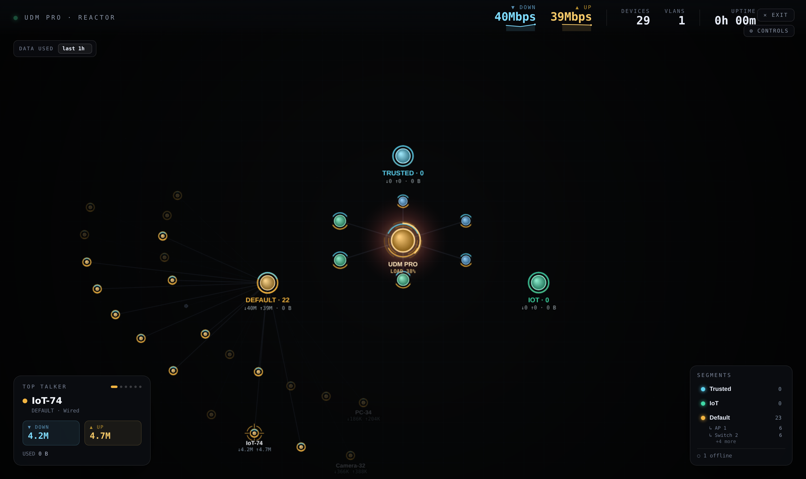
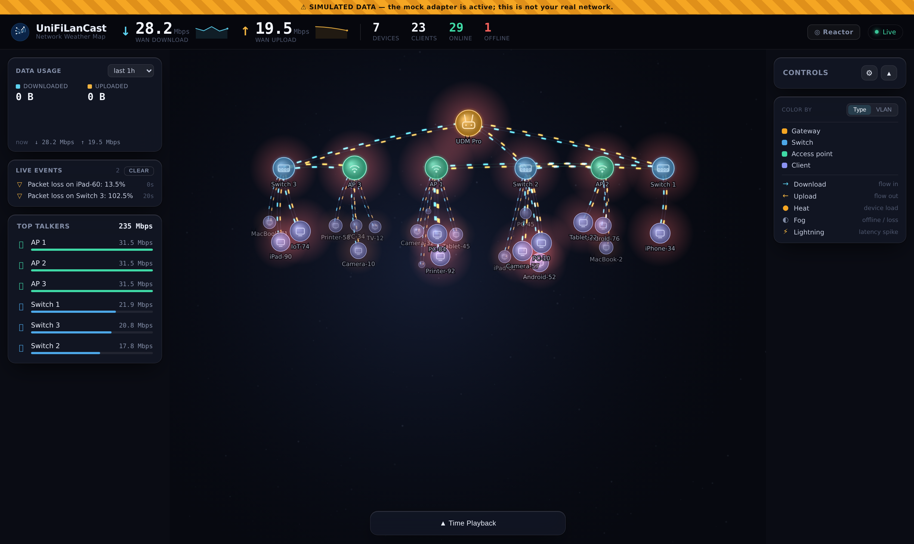

# UniFiLanCast — Real-Time UniFi Network Map

A real-time visualization and monitoring dashboard for your UniFi network. It ships two views of the same live data:

- **Reactor** (default) — a full-screen radial view: the gateway is the glowing core, switches/APs sit on a rotating spine ring, and the three VLAN segments are buses with their clients arced around them. Isolate a VLAN to trace the physical path (device → access switch/AP → gateway).
- **Constellation dashboard** — a live tiered map (gateway on top, switches/APs below, clients clustered beneath) that surfaces activity at a glance: traffic flow between nodes, device load, outages, and latency spikes each render as their own ambient visual cue.

 

> Connects to real UniFi hardware via the **local Network Integration API** (read-only API key). No cloud dependency required.

## Screenshots

**Reactor view** — the gateway as a glowing core, VLAN segment rings, and each hub's clients arced around it:



**Constellation dashboard** — the tiered topology with live traffic, device load, and outages surfaced visually, plus top talkers and a live event feed (shown here in mock mode):



---

## Highlights

- **Reactor view** — full-screen radial view (the default), driven by the live data. Per-VLAN **access breakdown** (which switch/AP each segment's devices attach through) with an on-filter **physical-path overlay**; a **quiet filter** that dims sub-1 Mbps nodes (with a 10s hold so bursty streams don't strobe); **data-used labels** on nodes that cross 1 GB in the window; down/up **sparklines** and an "Idle" state for near-zero WAN; click/hover device spotlight, VLAN legend/filter, and motion/intensity controls.
- **Accurate live rates** — per-client throughput is derived from the **change in cumulative byte counters between polls**, not UniFi's coarse `*-r` field, so active streams show their true rate. Wired clients (which report traffic under `wired-*` keys) are fully supported.
- **Live + historical bandwidth** — per-device download/upload, WAN throughput, and a **data-usage window** (5m / 15m / 30m / 1h / 2h / 8h). The selected window drives the panels *and* the node sizing, so the heaviest users over the window stand out even when momentarily idle.
- **Tiered + clustered layout** — gateway → switches/APs → each hub's own clients in an organic cluster beneath it; busy devices grow, brighten, and label themselves; idle ones recede.
- **Per-client detail** — click any node for live rate, windowed usage, session totals, signal, channel, VLAN, vendor (OUI), OS, IP/MAC, connected-since, and experience score.
- **VLAN coloring** — toggle to color clients by segment, with a per-VLAN throughput/segments panel.
- **Ambient activity effects** — directional download/upload flow strands, device-load glow, offline dimming, and latency-spike markers layered onto the map.
- **Dashboard** — live HUD, WAN trend chart, top talkers, segments, and a live events feed framing the map.
- **Persistence** — SQLite store keeps history, a device inventory with first-seen, and an event log across restarts.
- **Alerting** — webhook notifications (Discord / Slack / generic) with severity gating + throttling.
- **Auth** — optional HTTP Basic auth over the whole app.
- **Mock mode** — runs with simulated devices, no hardware required.

See [ARCHITECTURE.md](ARCHITECTURE.md) for how it's built and [NEXT_STEPS.md](NEXT_STEPS.md) for the roadmap.

---

## Quick start (development)

**Prerequisites:** Node.js 18+ (20.x recommended), npm.

```bash
git clone https://github.com/HouseofTyrell/UniFiLanCast.git
cd UniFiLanCast
npm install
cp config.example.json config.json
npm run dev
```

- Backend API → `http://localhost:3001`
- Frontend → `http://localhost:5173`

Out of the box it runs in **mock mode** (simulated devices). To connect real hardware, see [Connecting to real hardware](#connecting-to-real-hardware).

### Production (Docker)

A **single container** serves the API/SSE and the built web UI (no separate nginx):

```bash
cp config.example.json config.json    # mock mode works out of the box
docker compose up -d --build           # dashboard on http://localhost:8080
```

- Real hardware: put `UNIFI_API_KEY=...` in a `.env` file (auto-loaded) and enable the `integrationApi` adapter in `config.json`.
- SQLite history persists in the `unifi-data` volume (survives `docker compose down && up`).
- `config.json` is mounted read-write so the in-app config editor works.

> The container binds `0.0.0.0` internally (via `HOST`) while the compose port mapping is **`127.0.0.1:8080`** — host-loopback only by default. To expose it on your LAN, enable `auth` in `config.json` and change that mapping to `8080:3001`. (Outside Docker, `npm start` still binds `127.0.0.1` and refuses to start LAN-exposed without auth — fail-closed.)

---

## Connecting to real hardware

UniFiLanCast talks to your controller through the **local UniFi Network Integration API** using an API key.

1. Open the **UniFi Network application** (e.g. `https://10.0.0.1`) → **Settings → Control Plane → Integrations** → **Create API Key**. Copy it.
   - ⚠️ This is a *local Network* key, distinct from a `unifi.ui.com` cloud/account key. A cloud key returns `401` against the local `/proxy/network/integration/v1` API. See [unifi-integration-api-vs-cloud-key](#) notes in `ARCHITECTURE.md`.
2. Provide the key via the env var named in config (default `UNIFI_API_KEY`). The server auto-loads a gitignored `.env`:
   ```bash
   echo "UNIFI_API_KEY=your-key-here" > .env
   ```
3. Enable the adapter in `config.json`:
   ```json
   "integrationApi": { "enabled": true, "baseUrl": "https://10.0.0.1", "apiKeyEnv": "UNIFI_API_KEY", "verifySsl": false }
   ```
4. Restart (`npm run dev`). The same key also authenticates the legacy `stat/sta` endpoint, which the adapter uses to enrich **per-client** traffic, signal, VLAN, vendor, and totals.

The machine running the server must be able to reach the controller on the LAN.

---

## Configuration

Edit `config.json` (copied from `config.example.json`). Secrets should come from environment variables, not the file.

| Section | Key | Notes |
|---|---|---|
| `adapters.integrationApi` | `enabled`, `baseUrl`, `apiKey` / `apiKeyEnv`, `siteId?`, `pollingInterval?`, `verifySsl?` | **Recommended.** Local Integration API + per-client enrichment. |
| `adapters.mock` | `enabled`, `deviceCount` | Simulated devices, no hardware. |
| `adapters.siteManager` | `enabled`, `apiKey`, `pollingInterval` | UniFi cloud Site Manager API (inventory only — no per-client traffic). |
| `adapters.localNetwork` | `enabled`, `baseUrl`, `username`, `password`, … | Legacy username/password local API. |
| `server` | `port`, `historyRetentionMinutes` (default 1440), `logLevel`, `dataDir?` | SQLite store lives in `dataDir` (default `<repo>/data`). |
| `auth` | `enabled`, `username`, `password` / `passwordEnv` | Optional HTTP Basic auth over API + UI. Disabled by default. |
| `alerts` | `enabled`, `webhookUrl` / `webhookEnv`, `format` (`auto`/`discord`/`slack`/`json`), `throttleSeconds`, `minSeverity`, `rules` | Webhook alerts. Disabled by default. |

### Environment variables

| Var | Purpose |
|---|---|
| `UNIFI_API_KEY` | Integration API key (default name; override with `apiKeyEnv`). |
| `UNIFI_ALERT_WEBHOOK` | Alert webhook URL (default name; override with `webhookEnv`). |
| `UNIFI_AUTH_PASSWORD` | Basic-auth password (default name; override with `passwordEnv`). |
| `CONFIG_PATH` | Explicit path to `config.json` (otherwise auto-discovered up the tree). |
| `DATA_DIR` | Override the SQLite data directory. |
| `LOG_LEVEL`, `NODE_ENV` | Logging / production static-file serving. |

`.env` (gitignored) is auto-loaded at startup, and `config.json` is found whether the server runs from the repo root or `server/`.

---

## API reference

| Endpoint | Description |
|---|---|
| `GET /api/snapshot` | Current network state (devices, links, events, effects). |
| `GET /api/stream` | Server-Sent Events stream of snapshots (~5s). |
| `GET /api/history?minutes=N` | Persisted history samples. |
| `GET /api/usage?minutes=N[&deviceId=ID]` | Total data down/up over the window (WAN, or a specific device) + a downsampled series. |
| `GET /api/usage/devices?minutes=N` | Per-device data usage over the window (drives node sizing). |
| `GET /api/status` | Adapter connection status. |
| `GET /api/config` · `POST /api/config` | Read / write the configuration file. |

All rates are normalized to **bits/sec** internally; volumes are reported in **bytes**. (Note: the Integration API reports device rates in bits/sec, but the legacy `stat/sta` client fields are bytes/sec — the adapter reconciles these. Wired clients report their counters under `wired-*` keys. For clients, the controller's `tx_bytes` is *download*, the reverse of the gateway convention; the adapter swaps it so "↓ = download" everywhere. **Per-client live rates are derived from cumulative-counter deltas between polls** — UniFi's `*-r` field is coarse and under-reports active streams.)

---

## Project layout

```
server/   Node + Fastify + TypeScript
  src/
    adapters/        MockAdapter, IntegrationApiAdapter, SiteManagerAdapter, LocalNetworkAdapter
    DataManager.ts   capture loop, snapshots, usage integration
    Store.ts         SQLite persistence (history, devices, events)
    AlertManager.ts  webhook alerting
    routes/api.ts    REST + SSE
web/      React + Vite + HTML5 canvas
  src/
    utils/reactor/engine.ts  the Reactor renderer (radial core/spine/buses, VLAN uplinks + overlay, quiet filter, telemetry)
    utils/visualization.ts   the constellation renderer (layout, nodes, links, effects)
    components/              ReactorView, Header (+ Sparkline), NetworkCanvas, DeviceDetail, WanChart, Segments, TopTalkers, Events, Legend, Controls, TimePlayback
    hooks/                  useNetworkData (SSE), useRollingData, useDeviceUsages
```

`App.tsx` opens on the **Reactor** by default; **✕ Exit** (or `Esc`) drops to the constellation dashboard, and the header's **◎ Reactor** button returns.

---

## Development

```bash
npm run build          # build server + web
npm run typecheck      # tsc --noEmit, both workspaces
npm run test           # Vitest, both workspaces
npm run ci             # local CI gate: typecheck + build + test
```

### Local CI

`npm install` wires a **git `pre-push` hook** (via `core.hooksPath=.githooks`) that runs `npm run ci` before every push, so broken builds never reach the remote. If you cloned and the hook isn't active, run:

```bash
git config core.hooksPath .githooks
```

Bypass in an emergency with `git push --no-verify`. CI is **local-only** for now (no GitHub Actions).

Tests use **Vitest** and cover the highest-risk logic (rate→bytes integration, config validation/redaction, alert delivery/throttle, formatting, VLAN coloring). They run in `npm run ci` and gate every push. See [NEXT_STEPS.md](NEXT_STEPS.md) for remaining coverage (adapter fixtures, hooks, layout). Keep server and web type definitions in sync.

---

## Security notes

- The server **binds `127.0.0.1` by default** and **refuses to start LAN-exposed (`server.host`) with `auth.enabled: false`** — a fail-closed default. To expose it, set `server.host: "0.0.0.0"` and enable auth (ideally behind a reverse proxy with HTTPS).
- `GET /api/config` **redacts secrets**; `POST /api/config` is **disabled by default** (returns 403) — config writes are only permitted with `auth.enabled` or an explicit `server.allowConfigWrites: true`, and require a JSON content-type. Validated + written atomically.
- `verifySsl` **defaults to `true`** — set it to `false` explicitly (or pin a CA) for a controller's self-signed cert.
- Never commit `config.json` or `.env` (both gitignored). Use a read-only API key, sourced from an env var.

## License

MIT — see [LICENSE](LICENSE). UniFi is a trademark of Ubiquiti Inc.
